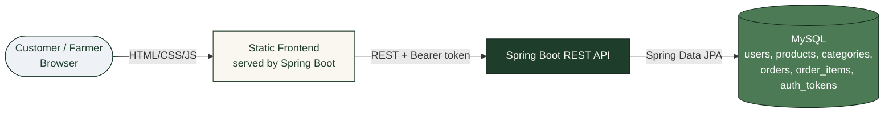
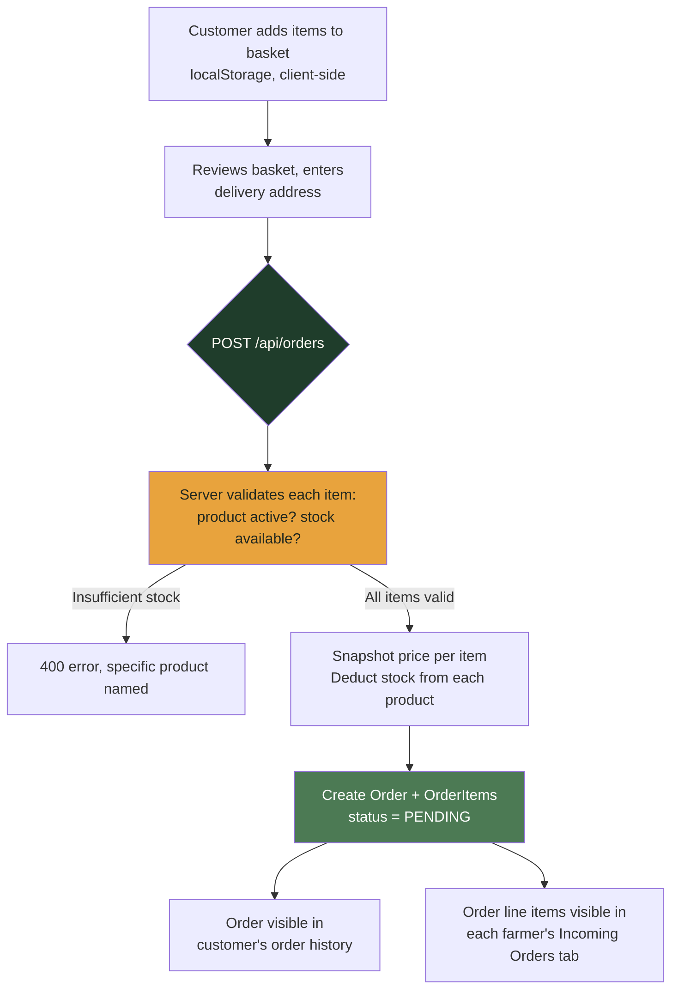
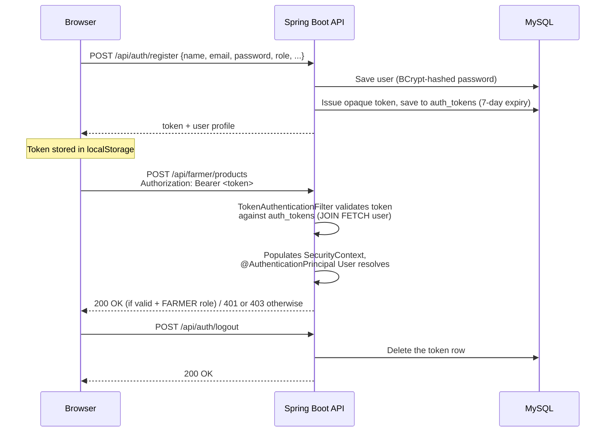

<div align="center">

# 🌱 AgriConnect

### Farm-to-Customer Marketplace Platform

Farmers list their harvest directly. Customers buy fresh, no middlemen — powered by Spring Boot, backed by MySQL, secured with token-based auth.

[](https://openjdk.org/)
[](https://spring.io/projects/spring-boot)
[](https://spring.io/projects/spring-security)
[](https://www.mysql.com/)
[](https://developer.mozilla.org/en-US/docs/Web/JavaScript)
[](#license)

[Overview](#overview) • [Features](#features) • [Architecture](#architecture) • [Getting Started](#getting-started) • [API Reference](#api-reference) 

</div>

---

## Overview

**AgriConnect** connects local farmers directly with customers. Farmers list produce with their own price and quantity; customers browse, search, and check out; the farmer ships it and updates order status along the way. No aggregator sits in between and no commission is skimmed off the top.

Built as a complete demonstration of a classic three-tier web stack: **Spring Boot REST API** on top of **MySQL** via Spring Data JPA, secured with a lightweight **Bearer-token auth** scheme, served by a **vanilla HTML/CSS/JS** frontend with zero build tooling — the whole app runs from a single `mvn spring-boot:run`.

---

## Features

| Category | Feature | Description |
|---|---|---|
| **Core** | Dual-role accounts | One `users` table, one `role` column — **FARMER** or **CUSTOMER** — with role-specific UI and permissions |
| **Core** | Product listings | Farmers create/edit/remove produce with price, unit, stock, category, organic flag, and image URL |
| **Core** | Marketplace browsing | Search by keyword, filter by category, view full product detail in a modal |
| **Core** | Basket & checkout | Client-side basket (persisted in `localStorage`), server-side stock validation at checkout |
| **Core** | Order lifecycle | `PENDING → CONFIRMED → PACKED → SHIPPED → DELIVERED` (or `CANCELLED`), updatable by the fulfilling farmer |
| **Auth** | Register / Login / Logout | Bearer-token auth, BCrypt-hashed passwords, 7-day token expiry stored server-side |
| **Auth** | Per-role route protection | `/api/farmer/**` requires a FARMER account; order placement requires a CUSTOMER account — enforced server-side, not just hidden in the UI |
| **Data integrity** | Price snapshotting | `OrderItem.priceAtOrder` freezes the price at purchase time, so later price changes never rewrite order history |
| **Data integrity** | Soft-deleted products | Removing a listing sets `active = false` instead of a hard delete, so historical orders keep a valid reference |
| **Resilience** | Clean error responses | A global exception handler turns validation errors, ownership violations, and not-found cases into consistent JSON — no raw stack traces reach the client |
| **UX** | Zero-build frontend | Plain HTML/CSS/JS served as Spring Boot static resources — one server, one port, no npm install |

---

## Tech Stack

| Layer | Technology |
|---|---|
| Backend | Java 17, Spring Boot 3.3 (Web, Data JPA, Validation, Security) |
| Database | MySQL 8.x (H2 in-memory supported for zero-setup local testing) |
| Auth | Spring Security + custom Bearer-token filter, BCrypt password hashing |
| Serialization | Jackson + `jackson-datatype-hibernate6` (safe handling of lazy-loaded JPA relationships) |
| Frontend | HTML5, CSS3 (custom design system, no framework), vanilla JavaScript |
| Build | Maven |


---

## Architecture

### System overview



### Checkout flow



### Authentication flow


<pre>
```
agriconnect/
├── pom.xml
├── database/
│   └── schema.sql                      # reference SQL schema + seed data (manual setup)
└── src/main/
    ├── java/com/agriconnect/
    │   ├── AgriConnectApplication.java
    │   ├── config/
    │   │   ├── SecurityConfig.java       # CORS, stateless sessions, route rules
    │   │   └── JacksonConfig.java        # safe serialization of lazy JPA proxies
    │   ├── security/
    │   │   └── TokenAuthenticationFilter.java  # Bearer-token auth filter
    │   ├── model/                        # User, Product, Category, Order, OrderItem, AuthToken
    │   ├── repository/                   # Spring Data JPA repositories
    │   ├── service/                      # UserService, ProductService, OrderService
    │   ├── controller/                   # AuthController, ProductController, FarmerController, OrderController, CategoryController
    │   ├── dto/                          # Request/response payloads + validation
    │   └── exception/                    # Custom exceptions + GlobalExceptionHandler
    └── resources/
        ├── application.properties        # env-overridable datasource config
        ├── data.sql                      # seeds product categories on startup
        └── static/                       # entire frontend, served by Spring Boot
            ├── index.html                  (landing page)
            ├── login.html / register.html
            ├── marketplace.html            (browse / search / filter / add-to-basket)
            ├── cart.html                   (basket + checkout)
            ├── orders.html                 (customer order history)
            ├── farmer-dashboard.html        (manage listings + incoming orders)
            ├── css/style.css
            └── js/api.js, app.js
```
</pre>
            ---

## Getting Started

### Prerequisites

| Requirement | Version |
|---|---|
| Java (JDK) | 17+ |
| Maven | 3.8+ |
| MySQL | 8.x (or use the built-in H2 fallback — see below) |

### Installation

```bash
cd agriconnect

# Point the app at your MySQL instance (defaults shown below already work
# for a local MySQL with a root/root login and no manual DB creation needed)
export DB_URL="jdbc:mysql://localhost:3306/agriconnect_db?createDatabaseIfNotExist=true&useSSL=false&serverTimezone=UTC"
export DB_USERNAME=root
export DB_PASSWORD=your_mysql_password

mvn clean install
mvn spring-boot:run
```

Open **http://localhost:8080** — frontend and backend are the same app on the same port.

**No MySQL handy?** Open `application.properties`, comment out the MySQL block, uncomment the H2 in-memory block. Zero setup, data resets on restart.

### Environment Variables

| Variable | Required | Default | Purpose |
|---|---|---|---|
| `DB_URL` | No | `jdbc:mysql://localhost:3306/agriconnect_db...` | Full JDBC connection string |
| `DB_USERNAME` | No | `root` | MySQL username |
| `DB_PASSWORD` | No (recommended in prod) | `root` | MySQL password |
| `PORT` | No | `8080` | Injected automatically by most cloud hosts |

### Try it out

1. Go to `/register.html`, create a **farmer** account (toggle "I'm a farmer").
2. Log in, open **My Farm**, click **+ Add produce** to list a few items.
3. Open an incognito window, register a **customer** account.
4. Browse `/marketplace.html`, add items to your basket, and check out.
5. Back on the farmer account, open **Incoming Orders** to progress order status (Confirmed → Packed → Shipped → Delivered).

---

## API Reference

### Auth — `/api/auth`

| Method | Endpoint | Auth required | Description |
|---|---|---|---|
| POST | `/register` | No | Create a customer or farmer account, returns a token |
| POST | `/login` | No | Log in, returns a token |
| POST | `/logout` | Token | Invalidate the current token |
| GET | `/me` | Token | Current user profile |

### Products — `/api/products` & `/api/farmer/products`

| Method | Endpoint | Auth required | Description |
|---|---|---|---|
| GET | `/api/products?q=&categoryId=` | No | Browse/search active products |
| GET | `/api/products/{id}` | No | Product detail |
| GET | `/api/farmer/products` | Farmer | List my own products (active + removed) |
| POST | `/api/farmer/products` | Farmer | Create a listing |
| PUT | `/api/farmer/products/{id}` | Farmer (owner) | Update a listing |
| DELETE | `/api/farmer/products/{id}` | Farmer (owner) | Soft-delete a listing |

### Orders — `/api/orders` & `/api/farmer/orders`

| Method | Endpoint | Auth required | Description |
|---|---|---|---|
| POST | `/api/orders` | Customer | Place an order (checkout) |
| GET | `/api/orders` | Customer | My order history |
| GET | `/api/orders/{id}` | Owner/farmer | Order detail |
| PATCH | `/api/orders/{id}/status` | Owner/farmer | Update order status |
| GET | `/api/farmer/orders` | Farmer | Order line items for my products |

### Categories — `/api/categories`

| Method | Endpoint | Auth required | Description |
|---|---|---|---|
| GET | `/` | No | List product categories |

**Example — place an order:**
```json
POST /api/orders
Authorization: Bearer <token>

{
  "deliveryAddress": "12 MG Road, Madurai, Tamil Nadu 625001",
  "contactPhone": "9876543210",
  "items": [
    { "productId": 1, "quantity": 3 },
    { "productId": 4, "quantity": 1 }
  ]
}
```

---

## Database Schema

| Table | Key Columns | Purpose |
|---|---|---|
| `users` | `id`, `email` (unique), `password` (BCrypt hash), `role`, `farm_name`, `farm_location` | Farmer and customer accounts |
| `categories` | `id`, `name` (unique), `icon` | Product categories (Vegetables, Fruits, Dairy, etc.) |
| `products` | `id`, `name`, `price`, `unit`, `quantity_available`, `organic`, `active`, `farmer_id`, `category_id` | Every listing, soft-deleted via `active` |
| `orders` | `id`, `customer_id`, `total_amount`, `delivery_address`, `status`, `order_date` | One row per checkout |
| `order_items` | `id`, `order_id`, `product_id`, `farmer_id`, `quantity`, `price_at_order`, `subtotal` | Line items, with a frozen price snapshot |
| `auth_tokens` | `id`, `token` (unique), `user_id`, `expires_at` | Opaque bearer tokens, 7-day expiry |

See [`database/schema.sql`](database/schema.sql) for the full DDL and seed data — Hibernate (`ddl-auto=update`) creates/updates all of this automatically on startup, so manual setup is optional.

---


## Design Notes

- **Stock deduction happens at checkout**, inside the same transaction as order creation, with a hard stock check to prevent overselling.
- **Lazy JPA relationships + Bearer-token auth** don't mix well by default — the auth filter's token lookup uses `JOIN FETCH` on the user to avoid `LazyInitializationException`, and `jackson-datatype-hibernate6` handles any other lazy proxy Jackson encounters when serializing responses.
- **Ownership checks live in the service layer**, not just the UI — a farmer can only edit/delete their own listings, and only the order's customer, the fulfilling farmer, or an admin can view/update an order.


## Contributing

Contributions, issues, and feature requests are welcome. Feel free to open an issue or submit a pull request.
